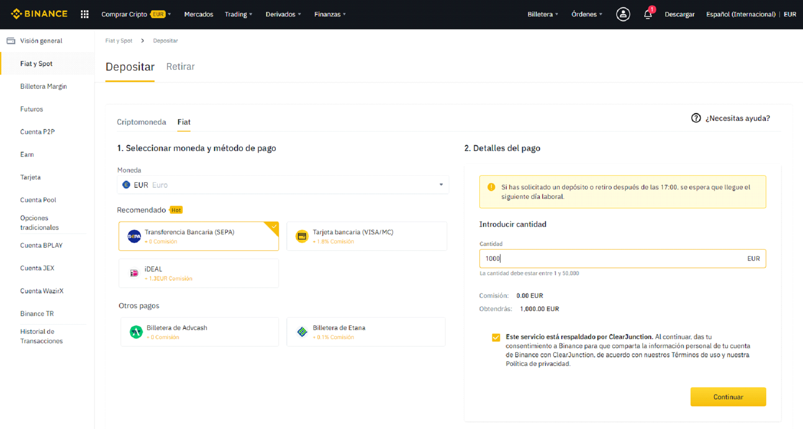

# Depositar fondos en Binance - PC

## 

## Cómo depositar fondos en Binance \(Transferencia Bancaria SEPA\)

Para cargar fondos en Binance lo haremos de la siguiente manera.

### 1. Pulsa el botón “Comprar Cripto” del menú de la Barra superior en Binance.

### 2. Selecciona la opción “Depósito Bancario”.

### 3. Selecciona la moneda correspondiente, introduce la cuantía y has clic en continuar.

### 4. Rellena la información de pago detallada.

⦁ Completa el depósito en tu cuenta.

⦁ Puedes obtener información más detallada y respuestas a preguntes frecuentes en la propia web de Binance \(⦁ Cómo hacer depósitos de monedas fíat por transferencia bancaria \(SEPA\) \| ⦁ Binance⦁ ⦁ Support o ⦁ Comprar cripto \(Fiat\) ⦁ ｜⦁ ⦁ Binance⦁ ⦁ Support\).

⦁ A continuación, pulsamos el botón “Crear cuenta” y completamos la verificación de seguridad deslizando la pieza del puzzle al lugar correcto haciendo clic y deslizando en la pieza o en la flecha amarilla.

⦁ Una vez hecho se nos pedirá en la página que introduzcamos un código de verificación que se nos ha enviado al correo electrónico que hemos utilizado para dar el alta.

⦁ Nos habrá llegado un correo electrónico de este estilo.

⦁ Utiliza el código de seis dígitos enviado a tu correo para completar la verificación. 

⦁ Una vez completada la verificación ya estamos dados de alta en Binance y se nos ofrecen tres opciones.

⦁ Para las opciones de depósito Fiat o compra con tarjeta de crédito deberás pasar un proceso de identificación “KYC” \(Know your customer\). Sigue los pasos marcados en la plataforma. Este proceso es un proceso de seguridad para vincular la cuenta con una empresa o persona física, para completarlo necesitarás un DNI, Carnet de Conducir o Pasaporte y tener webcam o poder hacer la verificación con el móvil. 

⦁ Ya estas dado de alta en Binance. Una vez identificado en la plataforma podrás cargar saldo o comprar cripto para pasar a Binance Smart Chain. Estos pasos los podrás ver en el correspondiente tutorial.

