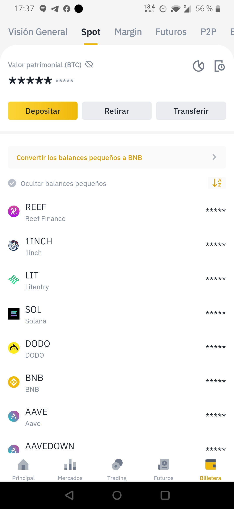
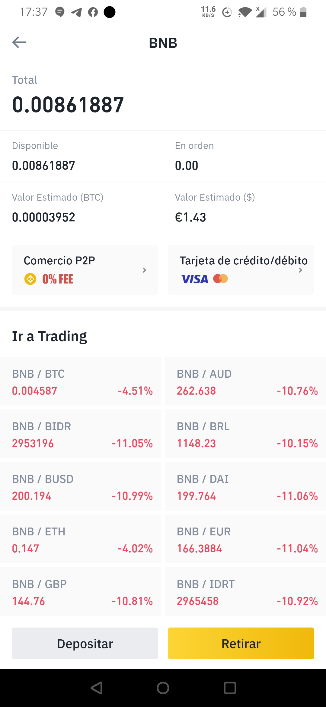
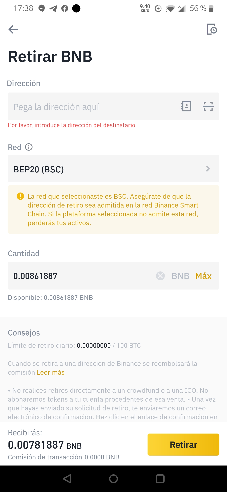

# Cómo enviar fondos de Binance a TrustWallet - Smartphone/Tablet

## Cómo enviar fondos de Binance a TrustWallet - Smartphone/Tablet

### 1. Averiguar tu dirección de BSC.

Ve a tu billetera Smart Chain y presiona recibir para encontrar tu dirección “Smart Chain”.

### 2. Depositar activos desde Binance.

Para depositar activos BEP20 en tu billetera. La manera más fácil es hacerlo desde Binance, ya sea con la APP o desde la página web. Escoge en Binance la criptomoneda que admita retiros a través de BEP20 y realiza un retiro a la dirección de Binance Smart Chain de tu Trust Wallet \(la que has copiado en el punto 3\). Ten en cuenta que se requiere tener BNB para realizar cualquier tipo de transacción en Binance Smart Chain. Por lo tanto, en el paso [Comprar BNB en Binance - Móvil/Tablet](primeros-pasos-binance-smartphone-tablet/comprar-bnb-en-binance-smartphone-tablet.md) habrás comprado los BNB que ahora transferirás.

### 3. Abrir la aplicación Binance.

### 4. Accede a la billetera.

Accede a la Billetera pulsando el icono “Billetera” en la parte inferior de la pantalla.

### 5. Selecciona Spot.

Aparece la pantalla con el resumen de tu Billetera Spot.

### 6. Selecciona el Token “BNB”.

Se mostrará el detalle de token BNB.

### 7. Selecciona "Retirar".

Selecciona “Retirar” pulsando el botón amarillo en la parte inferior.

### 8. Pegar la dirección copiada de Trust Wallet en la dirección a la que enviar los BNB.

Ver paso 1.

### 9. Seleccionar la red “Binance Smart Chain \(BNB\)” BEP20 \(BSC\).

### 10. Introducir el número de BNB a enviar a la billetera y pulsar “Retirar”.

Una vez enviada aparecerá una pantalla de verificación. Después, pasado unos minutos te llegará un correo de Binance confirmando el retiro. 

A continuación, te llegará una notificación de Trust Wallet indicando que se han recibido los BNB enviados.

### 4. Buen trabajo! Has terminado de enviar tus criptomonedas. Ya puedes usar tus BNB en TrustWallet.

Una vez que recibas un token BEP20, para ver tu ID de transacción puedes hacer clic en la transacción, presionar el botón de compartir en la esquina superior derecha y luego copiar el ID de transacción.

