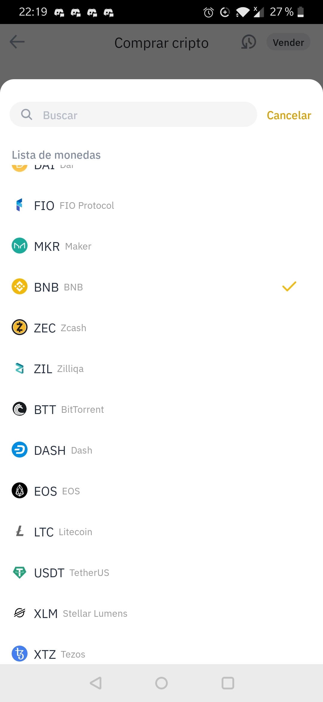
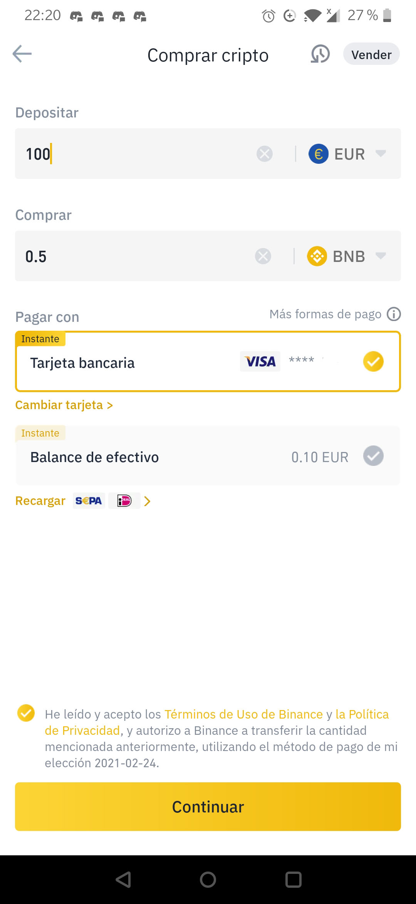
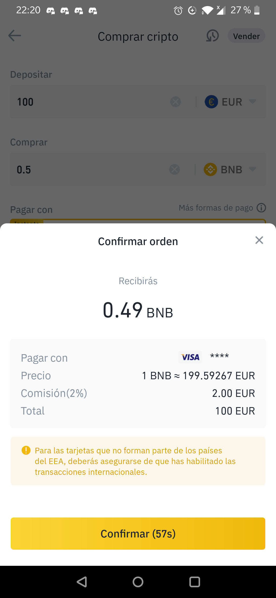

# Comprar BNB en Binance - Smartphone/Tablet

## Cómo comprar BNB en Binance a través de Smartphone/Tablet \(Tarjeta de Crédito\)

Para comprar cripto con tarjeta de crédito en la app de Binance para el Smartphone haremos lo siguiente.

### 1. Pulsa el botón “Comprar con EUR” de la parte central de la pantalla. 

En lugar de EUR puede aparecer otra divisa si es la divisa por defecto en tu país.

### 2. Selecciona el importe en Euros.

Recuerda que, en la mayoría de proyectos de la Red Binance Smart Chain utilizan como toquen básico BNB y además se utiliza BNB para pagar las comisiones. Por lo tanto, necesitarás tener BNB en tu billetera para trabajar en Binance Smart Chain. Puedes seleccionar BNB en el combo de selección de criptomoneda.

### 3. Selecciona BNB.

### 4. Introducir el importe en EUR.

Una vez seleccionada la criptomoneda que deseamos comprar, nos aparece el número de criptomonedas que vamos a comprar con el importe en EUR \(Fiat\) que hemos seleccionado anteriormente.

### 5. Pulsa “Continuar”.

Te aparece una pantalla con el detalle exacto de la operación.

### 6. Pulsa "Confirmar".

Revisa los datos de la transacción y si estas conforme pulsa “Confirmar”. Ten en cuenta que estas operaciones tienen una validez de 60 segundos, pasado este tiempo se tendrán que recargar.

### 7. Ingreso finalizado.

Una vez validada la operación te aparecerá una pantalla de confirmación. Hay que tener en cuenta que el pago puede necesitar de acciones propias de tu banco.

