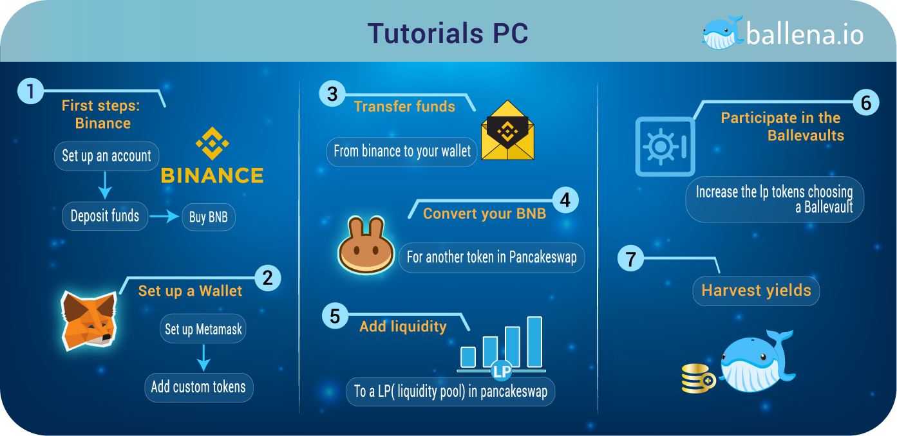

# PC

You have chosen the PC. The steps are almost similar for both platforms but we have designed these highly detailed steps in[ ballena.io](https://ballena.io/).


No step should be performed without completing the previous one. Click on the image to view full size.


We will need these tools for the PC:

* **Web browser** - This tutorial is performed in Google Chrome.
* **Wallet** - We will use Metamask in this case.

‌The web browser will let us navigate through the webs and Dapps like[ ballena.io](https://ballena.io/), Binance and PancakeSwap. And we will use the wallet to access the Dapps, move our crypto and buy, sell, trade, add liquidity and pay fees.

