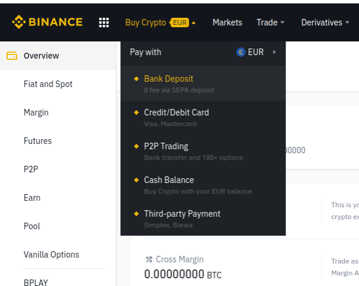
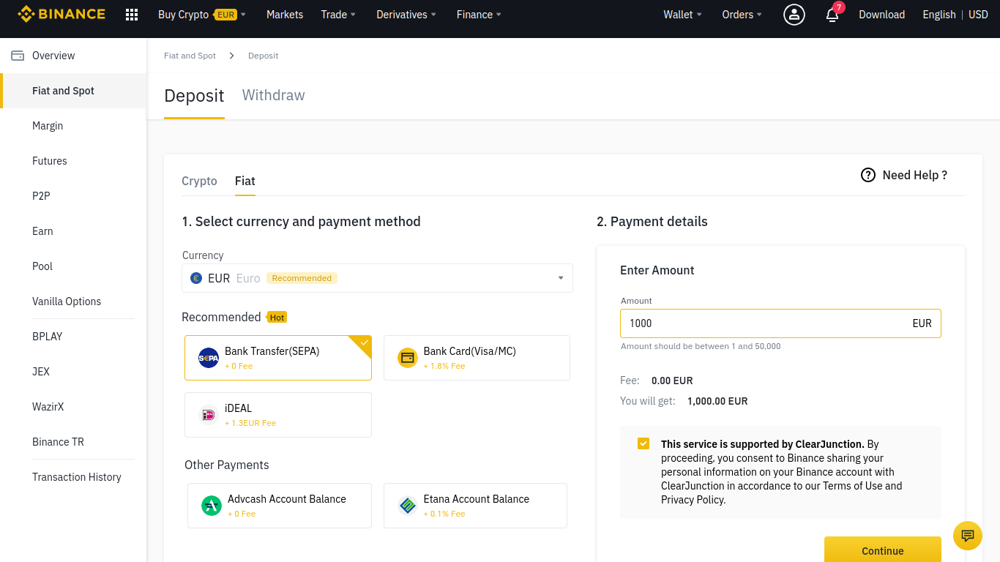

# Deposit funds in Binance - PC

## How to deposit funds in Binance

### 1. Click on the button "Buy Crypto" located in the top bar menu.

### 

### 2. Select the "Bank Deposit" option.

### 3. Select the desired currency, enter the quantity and click on "Continue".

### 

### 4. Get the Payment details.

### 

### 5. Complete the deposit from your bank account from its web page or app. 

Remember: Correctly fill the required fields and data for your bank transfer.

