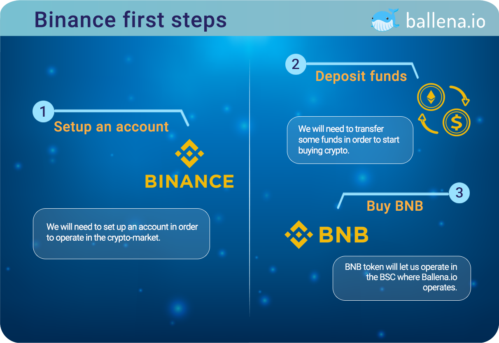

# First steps: Binance

Binance is an exchange \(cryptocurrency buy/sell platform\) in which we must open an account, deposit money and buy the BNB coin.

Why BNB and not any other coin? BNB \(Binance Coin\) is the currency of Binance and, as we already know, the[ ballena.io](https://ballena.io/)🐋 platform works on the Binance Smart Chain \(BSC\). Within the BSC we will carry out a series of movements for which we will need BNB as a bargaining chip. Let's imagine the BSC as a country with its own currency in which we will not be able to buy anything without having any cash. In this case, BNB will help us to buy other tokens and to pay the transaction fees.

Let's get down to the basics of buying those BNBs by following all the steps in this tutorial. Click the link to navigate to the first Binance tutorial:



