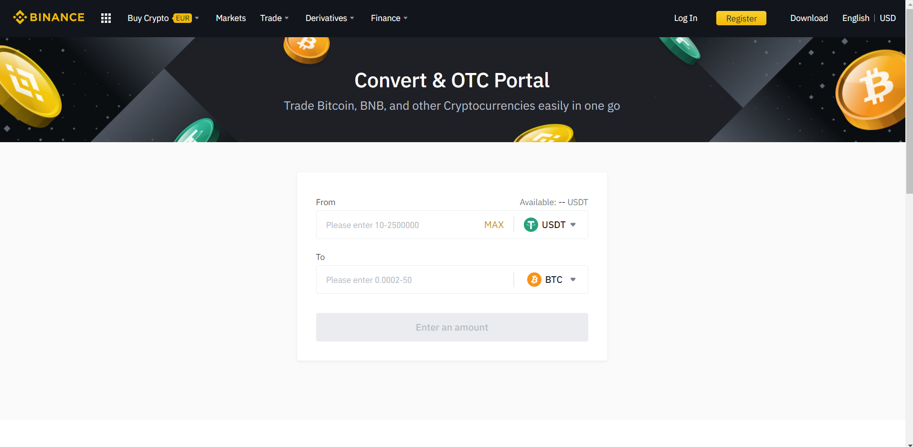
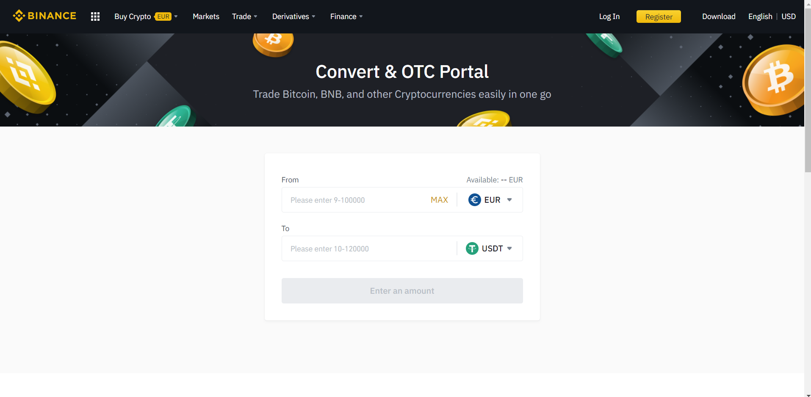
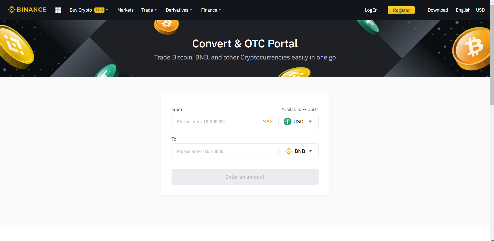

# Convert funds for BNB in Binance

Once EURs have been deposited in our Binance account, we have to trade these coins for BNB in order to work in the BSC and in [ballena.io](https://ballena.io/). 

In case we have deposited EUR we will have to convert this money twice due to some conversion limitations in Binance. We will trade EUR for USDT and the USDT for BNB as there is no direct conversion from EUR to BNB.

### 1. Open the [Binance](https://www.binance.com/es) web.

### 

### 2. Log in to your Binance account.

### 3. Click on "Trade" and "Convert".

### 4. Select EUR y USDT as shown in the next picture.

### 5.Enter the desired amount and confirm the transaction.

Before confirming the transaction you will be given a conversion preview, check everything is all right and press "Confirm".

### 6. Now you will have to do the same thing for USDT-BNB. Select "Convert" again, choose USDT and BNB as shown in the picture below.

### 5.Enter the desired amount and confirm the transaction.

Before confirming the transaction you will be given a conversion preview, check everything is all right and press "Confirm".

### 8. Done! You will now be able to check your BNB tokens in en "Wallet" - "Fiat and Spot".

