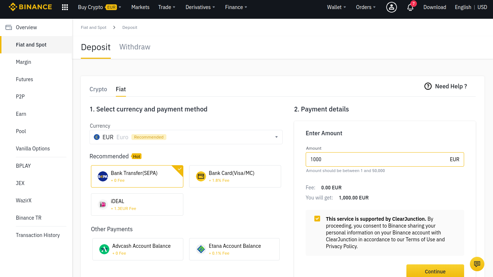

# Deposit funds in Binance

### 1. Click on the "Buy Crypto" button located in the top bar menu.

### 

### 2. Select the "Bank Deposit" option.

### 3. Select the desired currency, enter the quantity and click on "Continue".

### 

### 4. Get the Payment details.

### 

### 5. Complete the deposit from your bank account from its web page or App. 


Correctly fill the required fields and data for your bank transfer. Do not forget to add the 4-digit Reference Code in the concept of the transfer.


### **6. Wait until the money reaches Binance the very next day.** 

Meanwhile, you can continue reading the rest of the docs. Learn more about [ballena.io](https://ballena.io/)!

