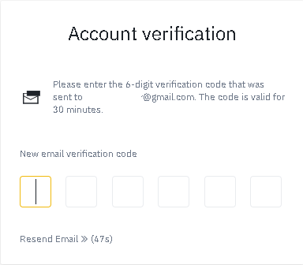

# Set up a Binance account

## How to set up a Binance account

In order to start working in the world of cryptocurrency, it is essential to register with an exchange. We can use any exchange that has the BNB currency. This tutorial focuses on[ Binance,](https://www.binance.com/es) so we better stick to it.

### 1. Navigate to [Binance](https://www.binance.com/en) in your browser.

Open your browser and navigate to the [Binance ](https://www.binance.com/en)webpage. We recommend you insert the address directly into your browser and always verify you are working in the right domain.

### 2. Click on "Register”.

### 

### 3. Fill in the fields.

Fill in the required fields with your mail and a safe password. 

### 

### 3. Click on "Create account".

Click on "Create account" and complete the security verification.

### 

### 4. Obtain the verification code.

Check your mail and get the required code.

You shall see an email like the following one.

### 

### 5. Introduce your verification code.

Use the received six-digit code to complete the verification phase.

### 6. Once verified, you have successfully set up a Binance account. 

For the next steps we must go through a “KYC” \(Know Your Customer\) identity verification process. We will follow the steps marked on the Binance platform. This is a security process to link the account with a company or a natural person. To complete it we will need an ID, Driving License or Passport and to be able to do the face scan with our phone. Once identified on the platform, we will be allowed to make Fiat deposits and buy cryptocurrency. There will be two different options for this:





