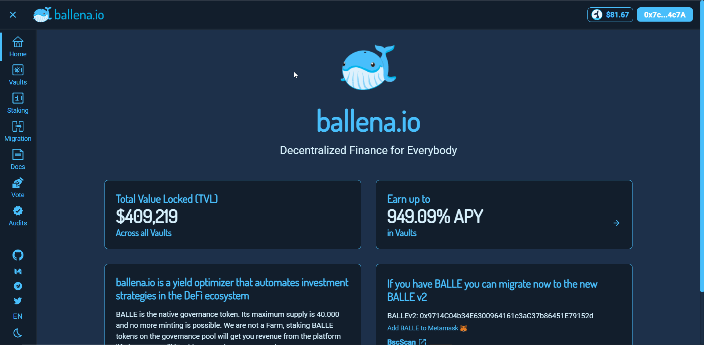

# Harvest BALLE from a BalleVault

In this short tutorial we will learn how to harvest the BALLE tokens generated as rewards in one of the vaults.

‌It is not necessary to withdraw your LP tokens to harvest the BALLE token rewards.

### **1. Access the**[ **ballena.io**](https://app.ballena.io/) **and connect your Metamask wallet.**

### \*\*\*\*

### **‌**

### **2. Navigate to the "Vaults" section.**

\*\*\*\*

### \*\*\*\*

### **3. Look for the vault where you deposited your funds, click on "Harvest" and confirm the transaction in Metamask.**

\*\*\*\*

\*\*\*\*

\*\*\*\*

### **‌4. The BALLE tokens have been added to your Metamask wallet.**


Remember to add the BALLE token correctly to your Metamask, otherwise you won't be able to see them.




