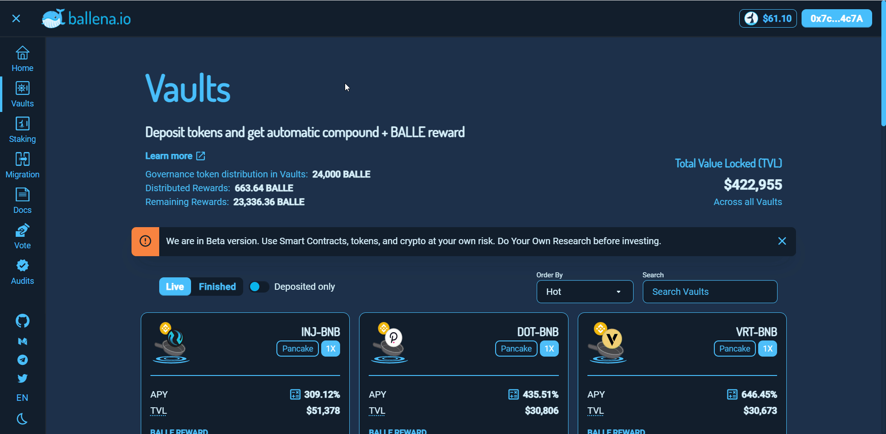

# Withdraw LPs from a BalleVault

In order to withdraw both the LP tokens and the profits generated in the vaults, we will follow this small tutorial. When you press withdraw button on a vault, you receive:

* The deposited LP tokens.
* The LP earned due to compound interest.
* BALLE token rewards.

Follow the steps below to do so.

### **1. Access the**[ **ballena.io**](https://app.ballena.io/) **and connect your Metamask wallet.**

**‌**

### \*\*\*\*

### **2. Navigate to the "Vaults" section.**

**‌**

\*\*\*\*

### **3. Look for the vault where you deposited your funds, click on "-", the withdraw button, and confirm the transaction in Metamask.**

**‌**

\*\*\*\*

### **4. You have already withdrawn your funds. Check that you have the corresponding LPs and the BALLE tokens in your wallet.**


Make sure you have those tokens correctly added to your Metamask or you won't be able to see them. Click on this [tutorial ](../metamask/how-to-add-a-custom-token-to-metamask.md)if needed.


You will be able to see your LP tokens both in Metamask and in the "Liquidity" section in [PancakeSwap](https://pancakeswap.finance/).

