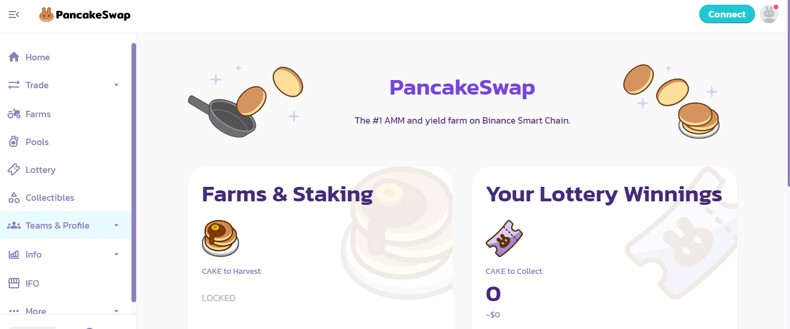
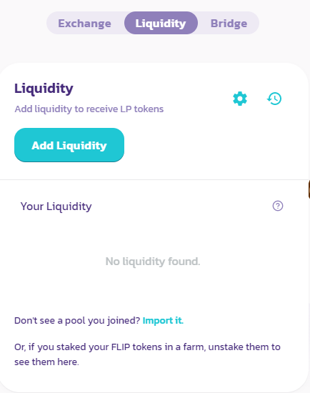

# Add liquidity to a LP - PC

## How to add liquidity to a LP in PancakeSwap

If you want to participate in a BalleVault at [ballena.io](https://ballena.io/), you should add liquidity to a LP\(Liquidity Pool\) in PancakeSwap. You should then open your browser and navigate to [Pancakeswap](https://pancakeswap.finance/) for that purpose. We need to take into account that if we are adding liquidity to a pair, we will need to supply the same value for both assets, so swaps may be required before this operation.

### 

### 1. Navigate to [PancakeSwap](https://pancakeswap.finance/).

### 2. Connect our wallet pressing the button "Connect" at the top right hand corner.

### 3. Click on "Trade" and then on "Liquidity" at the left side panel.

Remember that if we are adding liquidity to a pair, we will need to supply the same value for both assets, so swaps may be required before this operation. In case any swap is needed click on "Exchange" for performing it.

### 4. Click on "Add Liquidity".

### 

### 5. Select the tokens you want to supply. We will add LINA-BUSD for this example.

### 6. Click on "Supply" & "Confirm Supply".

### 7. The liquidity has been supplied.

The LINA/BUSD LP tokens are now available in your wallet and ready to be added to a BalleVaut. Follow to the next tutorial at:



