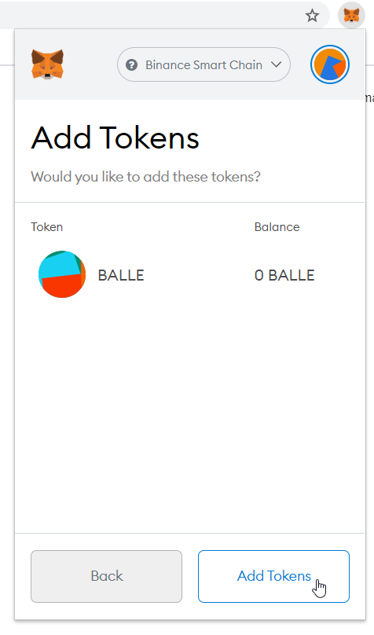

# How to Add a Custom Token to MetaMask

During the process of[ ballena.io](https://ballena.io/)🐋 you will work with several tokens, but MetaMask does not have the information for all of them. This does NOT mean that they will not be compatible with your wallet. It means that even if you are a holder of the token, it will not be reflected in your wallet. **You will need to add the information \(the contract\) of the token** to MetaMask so that it appears on the list of tokens and to **able to see its balance**.

**We will put the BALLEv2 \(BALLE\) token as an example** since it is the main character of this odyssey and because it is the only token that we know with certainty that we will handle.

We recommend **always adding the tokens to MetaMask before sending funds** to the wallet to avoid any scare.

\*\*\*\*

### 1. Open MetaMask on the top right corner of your browser. 

​

### 2. Click 'Add Token' at the bottom of the menu.

Make sure you are on the correct network \(BSC\).

​

​

### 3. Copy and paste the contract address for BALLEv2 token into the Address field and check the following fields are auto-completed, and click "Next".


Always copy the BALLEv2 address from an official ballena.io site.


**BALLEv2 Contract Address:** 0x9714C04b34E6300964161c3aC37b86451E79152d


Know that the actual name of the token is "BALLEv2" but MetaMask will always show it as its older version "BALLE".


### 5. Click 'Add Tokens' and...

### 7. BALLE🐋! Now BALLEv2 is available among your tokens and the wallet displays its balance.

​

Time to send those BNB we bought on Binance to MetaMask:



