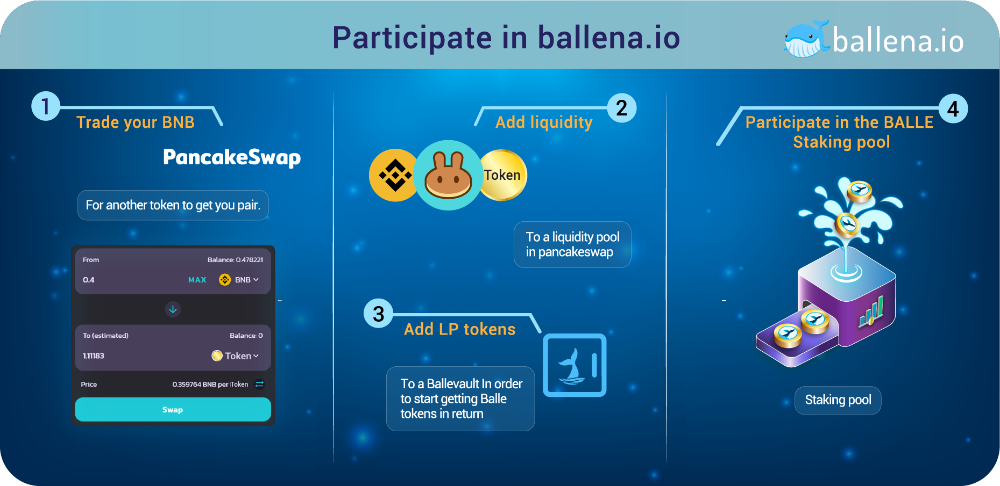

# Participate in ballena.io

In this tutorial we will learn how to **trade BNB** for another token in [PancakeSwap ](https://pancakeswap.finance/)with the intention of adding liquidity to a desired pair and be able to add these LP tokens to a BalleVault.

 **Provide liquidity to a BalleVault**

The user provides two assets of equal value. The return will then be in the form of these two assets too, the BalleVault will increase the LP tokens assigned to this BalleVault. For example, we could add liquidity to the pair Balbt /BNB. We will trade half of our BNB for Balbt and provide both to a Balbt /BNB LP. Adding the same value for both tokens means we should add 200$ worth in Balbt if we want to add 200$ worth of BNB.

We will have to trade BNB for Balbt in [PancakeSwap ](https://pancakeswap.finance/)as explained [here](how-to-participate-in-a-ballevault/how-to-trade-bnb-for-another-token-on-pancakeswap.md).

#### 

