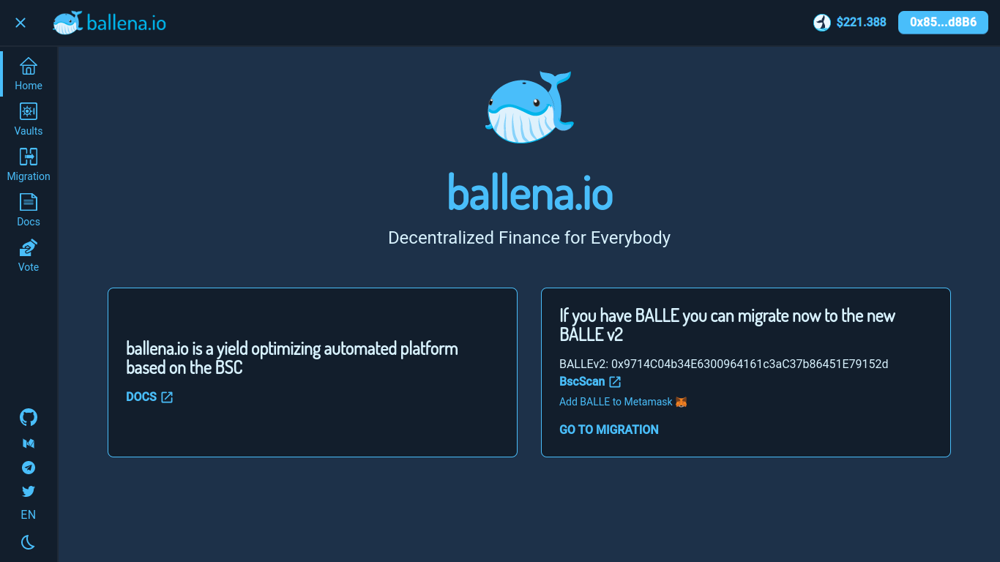
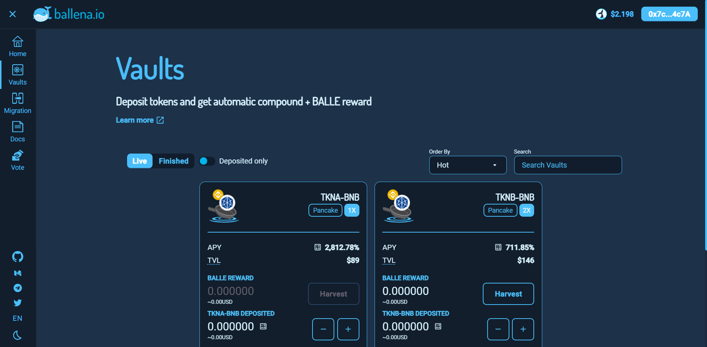

# Add LP tokens to a BalleVault

Just follow the steps in this short tutorial that[ **ballena.io**](https://ballena.io/) shows us to add the LP tokens to the BalleVaults and start generating passive income.  

### **1.Navigate the** [**ballena.io**](https://ballena.io/) **address.**

We will land on the Home Page.

Make sure we are on the right network. If not, change the network on MetaMask to the Binance Smart Chain.

### **2. At the top right, click "Connect".**

### 

### **3. Select the MetaMask wallet.**

\*\*\*\*

### **4. On the left menu go to the** _**Vaults**_ **interface.**

Find the corresponding vault to the LP tokens we own.

If we are following the example of the previous tutorials, we seek the vault "bALBT-BNB".

### **6. Deposit into the selected vault.**

 ****Approve the vault first.  

