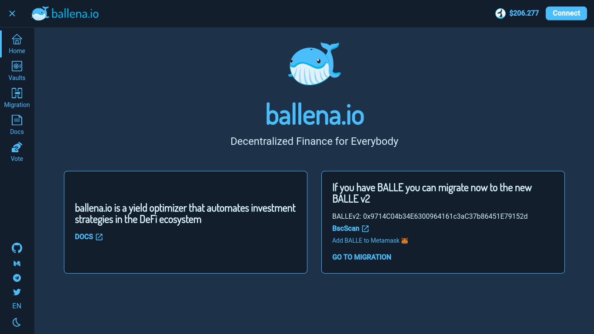

# Add LP tokens to a BalleVault

Just follow the steps in this short tutorial that[ **ballena.io**](https://ballena.io/) shows us to add the LP tokens to the BalleVaults and start generating passive income.  

### **1.Navigate the** [**ballena.io**](https://ballena.io/) **address.**

We will land on the Home Page.

Make sure you are on the right network. If not, change the network on MetaMask to the Binance Smart Chain.

### **2. At the top right, click "Connect".**

### 

### **3. Select the MetaMask wallet.**

\*\*\*\*

### **4. On the left menu go to the** _**Vaults**_ **interface.**

Find the corresponding vault to the LP tokens you own.

If you are following the example of the previous tutorials, seek the "bALBT-BNB" vault.

### **5. Deposit into the selected vault.**

 ****Approve the vault first.  

### **6. Once the menu is displayed, we select the quantity.**

Slide the little whale or just choose a percentage.

Approve the transaction in Trust Wallet and pay the gas fees.

### **8. Done! Our LP tokens are already working in the vault.**

We can also see how the amount of LPs as well as the amount of BALLE generated are progressively increasing.

Eventually, once we have **generated enough BALLE,** we will **harvest** them and **stake** them in the **Governance Pool**. Thus, with the BALLE you have earned, you will be able to **produce more BALLE** for your own **benefit**.



