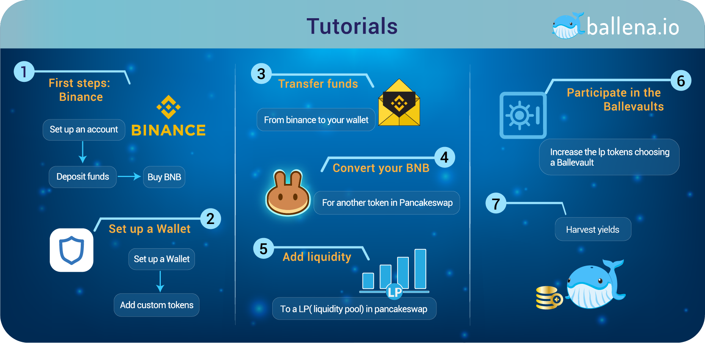

# Smartphone/Tablet

Mobile devices allow us to have access virtually anywhere, anytime. The steps to follow on a Smartphone are the same as on PC, but the tools we will be using and how they work will be different. That's why in[ ballena.io](https://ballena.io/) we separated them so that you have the most personalized help for each of the devices.

In the case of mobile devices, the following tools will be used:

* **Binance** App.
* Wallet - In this case we will use **Trust Wallet**.

The Binance application will be the bridge between our bank and the world of cryptocurrency. Then we will use it to connect with Trust Wallet.

And Trust Wallet, apart from being a secure wallet where we store our cryptocurrencies, will be our gateway to the Binance Smart Chain \(BSC\) blockchain, a decentralized platform in which Dapps \(decentralized applications\) such as PancakeSwap and [app.ballena.io🐋](https://app.ballena.io) operate.

Each step of this diagram is required to make our money generate high returns in[ ballena.io](https://ballena.io/)🐋.


No step should be performed without completing the previous one. Click on the image to view full size.


It might seem confusing at first glance, but each step is detailed so that we can understand it as we go through it. Let's get started!  



