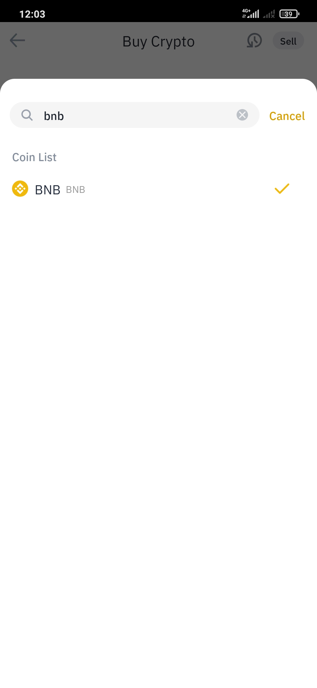
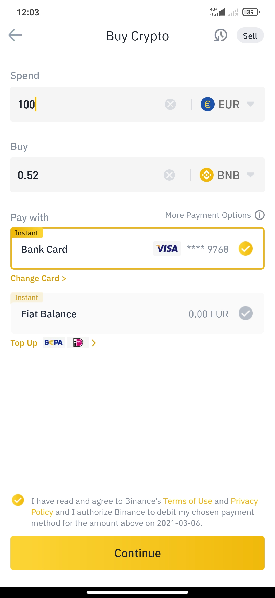

# Buy BNB in Binance - Smartphone/Tablet

## How to purchase BNB in Binance with your Credit Card

### 1. Open the Binance app.

### 2. Press "Buy with EUR".

You can use some other currencies depending on your country or base currency.

### 

### 2. Select the "Spend" currency.

Remember that you will need BNB for the fees payment in most of the BSC network projects.

### 3. Select BNB.

### 4. Enter the "Spend" amount.

### 5. Press “Continue” & Confirm the transaction.

### 6. Deposit completed.

