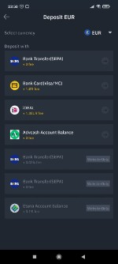
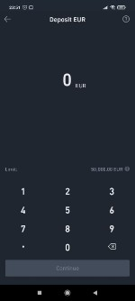
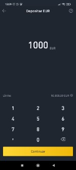

# Deposit funds in Binance

### 1. **Back on the Binance Home screen, click on “Deposit EUR” by SEPA Transfer.**

We can deposit any other Fiat currency but the transfer system will not be the same.  
****

### **2. Set an amount, press "Continue" and then "Confirm".**

Read carefully the Important Notes that appear on the screen   
****

### **3. We will receive the Payment Details.**

### \*\*\*\*

### **4. Access our bank via the Web or via the App and make an international transfer using the data we have been provided.**

In this step we will choose the exact amount we want to transfer.

**IMPORTANT:** do not forget to add the 4-digit Reference Code in the concept of the transfer.  
  
****

### **5. Wait until the money reaches Binance the very next day.** 

Meanwhile, we can continue reading the rest of the docs. Learn more about [ballena.io](https://ballena.io/)!

