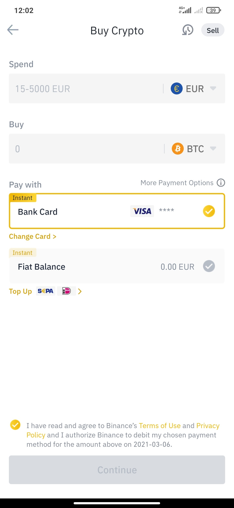
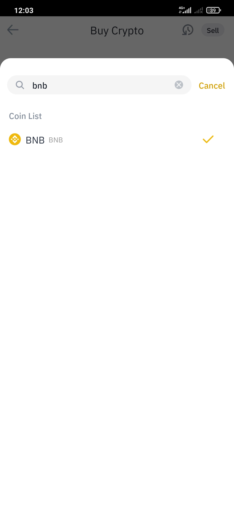
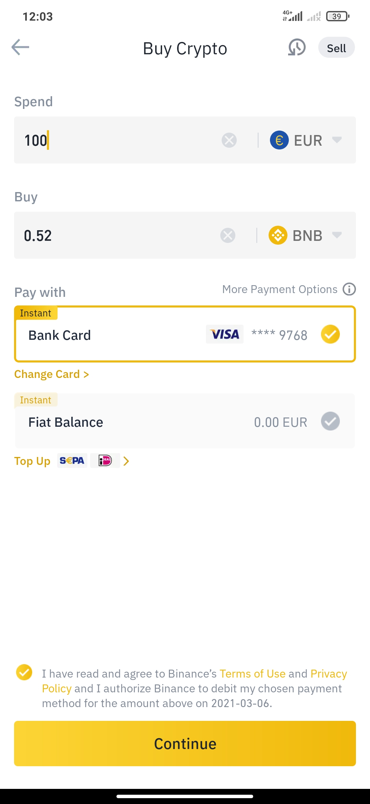

# Buy BNB in Binance \(Credit Card\)

## How to purchase BNB in Binance through Smartphone/Tablet \(Credit Card\)

This option offers a direct purchase of BNB by using your Credit Card. No deposit delays nor conversions needed. The process is much easier and faster but we shall know that a 1.8% fee is applied on the initial Fiat quantity.

### 1. Open the Binance App.

### 2. Press "Buy with EUR".

You can use some other currencies depending on your country's base currency.

### 

### 2. Select which Fiat you want to use on "Spend".

### 3. Select "Buy" BNB.

### 4. Enter the "Spend" amount.

We will be shown how many BNB we will be purchasing with this amount.

### 5. Press “Continue” & confirm the transaction.

You should take into account that some banks may require some authorization actions from you for this final payment.


**Make sure the money have been withdrawn from your bank account and the that it has been deposited in your Binance account.**


If both of the above are negative, make the deposit all over again.

### 6. Deposit completed.

After completing this process, we will have a small amount of BNB in ​​our Wallet and we will be ready for the next step:



