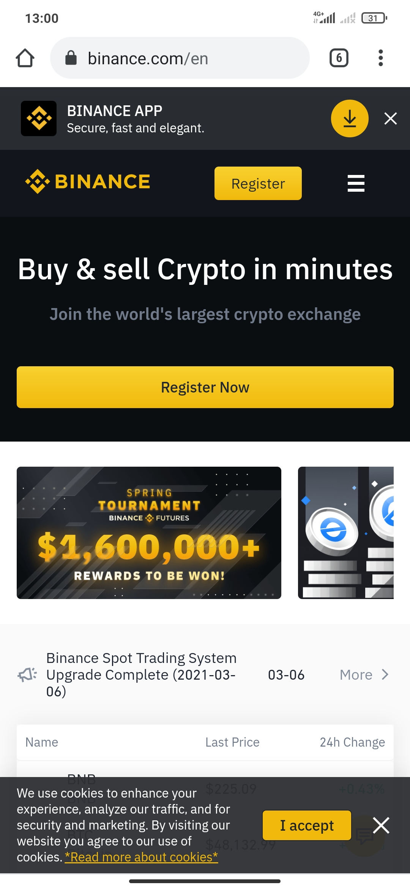
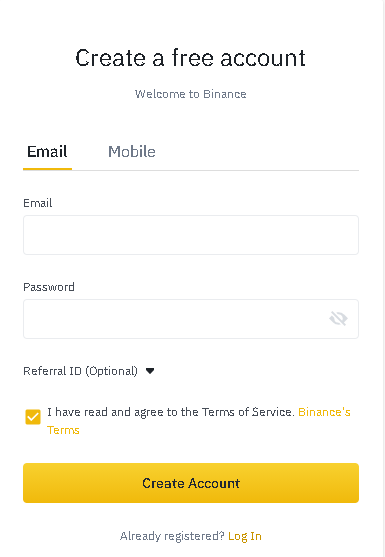
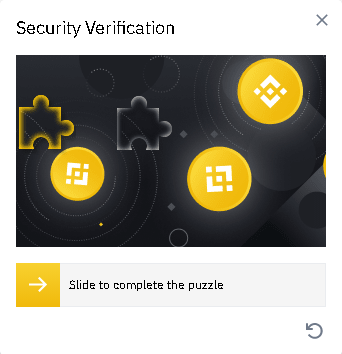

# Set up a Binance account

## How to set up a Binance account

In order to start working in the world of cryptocurrency, it is essential to register with an exchange. We can use any exchange that has the BNB currency. This tutorial focuses on[ Binance,](https://www.binance.com/es) so we better stick to it.  

### 1. Navigate to [Binance](https://www.binance.com/en) in the browser.

To register with Binance, we first have to go to its website. ****

### 2. Click on the Download button.

Press the banner to the App Store for the App download.

### 3. Install and open the App.

### 5. Create **an** account - Fill in the fields

We fill in the fields using our email and a secure password. Keep in mind that we will need constant access to this email account.

  

### 4. Click on "Create account".

And complete the Security Verification.

### 

### 5. Account verification.

Once done, we will have a verification code sent to our email.

### 6. Check mailbox

We shall find an email like the following one:

### 

### 6. Insert verification code.

Use the received 6-digit code to complete the verification phase.

### 7. Once verified, we have successfully set up a Binance account. 

For the next steps we must go through a “KYC” \(Know Your Customer\) identity verification process. We will follow the steps marked on the Binance platform. This is a security process to link the account with a company or a natural person. To complete it we will need an ID, Driving License or Passport and to be able to do the face scan with our phone. Once identified on the platform, we will be allowed to make Fiat deposits and buy cryptocurrency. There will be two different options for this:





