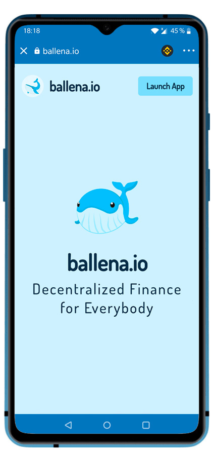

# How to navigate through Dapps in TrustWallet -  Smartphone/Tablet

## How to navigate through Dapps in Trust Wallet

### 1. iOS users will need the Dapp browser for accessing this utility. 

You can get the required browser in this [link](https://community.trustwallet.com/t/how-to-use-the-dapp-browser-on-ios/69390?ref=JLI1VBLA&utm_source=TrustTwitter&utm_medium=TrustSocial&utm_campaign=TrustSocial). The Dapp browser is included for all Android users, so if you are one of these, you don´t need to worry about it.

### 2. Open the Dapp browser.

Click on the 4 square icon at the lower part of the screen for accessing the Dapp browser.

### 3. Navigate to any BSC Dapps like PancakeSwap and open it.

### 3. Done! You are able to use the Dapps now!

## How to use the [ballena.io](https://ballena.io)  Dapp

### 1. iOS users will need the Dapp browser for accessing this utility. 

You can get the required browser in this [link](https://community.trustwallet.com/t/how-to-use-the-dapp-browser-on-ios/69390?ref=JLI1VBLA&utm_source=TrustTwitter&utm_medium=TrustSocial&utm_campaign=TrustSocial). The Dapp browser is included for all Android users, so if you are one of these, you don´t need to worry about it.

### 2. Open the Dapp browser.

Click on the 4 square icon at the lower part of the screen for accessing the Dapp browser.

### 3. Navigate to [https://ballena.io](https://ballena.io) entering this address at the top search bar.

### 

### 4. Press the button "Launch App".

### 5. Done! Now you can use the [ballena.io](https://ballena.io) Dapp!!

