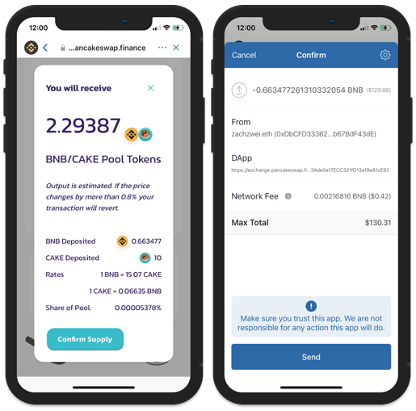

# Add liquidity to a LP - Smartphone-Tablet

## How to add liquidity in PancakeSwap through Trust Wallet

If you want to participate in a BalleVault at [ballena.io](https://ballena.io/), you should add liquidity to a LP\(Liquidity Pool\) in PancakeSwap. You should then open your browser and navigate to [Pancakeswap](https://pancakeswap.finance/) for that purpose. We need to take into account that if we are adding liquidity to a pair, we will need to supply the same value for both assets, so swaps may be required before this operation.

### 1. Access PancakeSwap in your Dapp browser.

Click on the 4 square icon at the lower part of the screen for accessing the Dapp browser. Go to the PancakeSwap Dapp in the Smart Chain part or enter the url: [https://exchange.pancakeswap.finance/](https://exchange.pancakeswap.finance/).

### 2. Click on “Liquidity” for supplying PancakeSwap. Now press “Add Liquidity”. 

Choose the tokens to be supplied and approve the contract. Now enter the desired token amount and the platform will automatically select the proportional other token´s amount.

### 

### 3. Click on "Supply" and then "Confirm Supply". The app will require confirmation. Press "Send" for supplying the tokens to PancakeSwap.

Once the tokens are supplied you will see a confirmation sign. Now that the tokens are supplied you won´t be able to see them in your wallet but you will be able to see the supplied LP Tokens.

### 4. The liquidity has been added.

