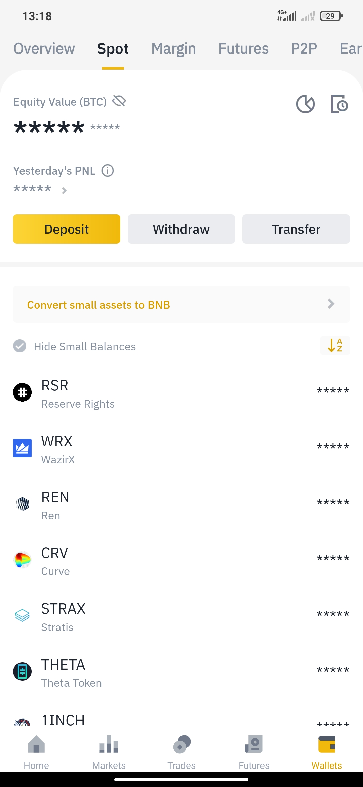
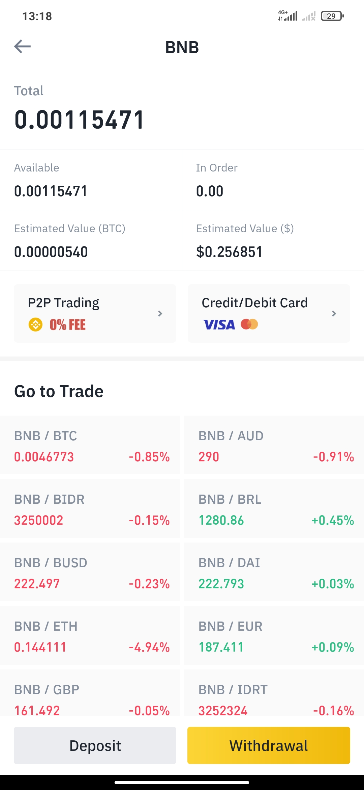
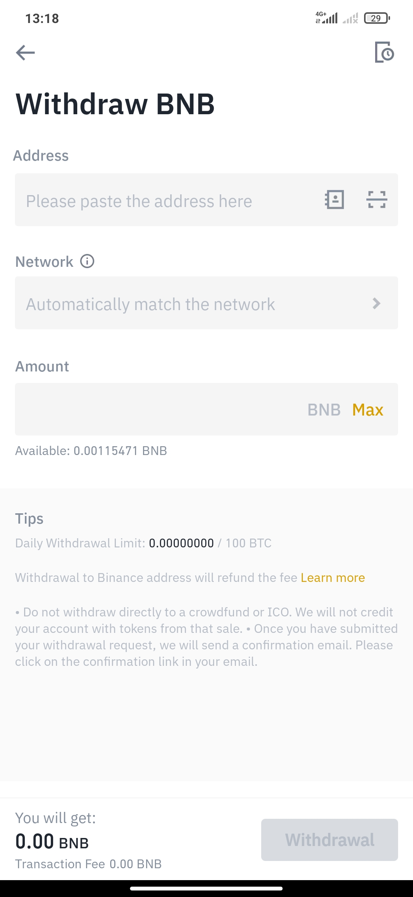
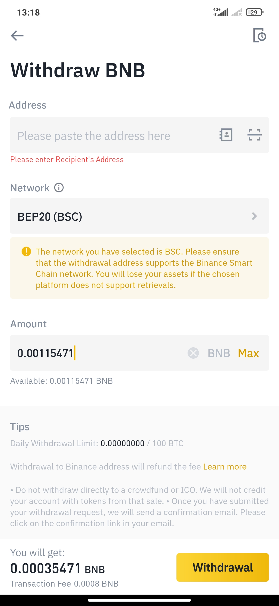

# How to send funds from Binance to TrustWallet - Smartphone/Tablet

### 1. Get your BSC address. 

Go to your Smart Chain wallet and press "Receive" in order to get your Smart Chain address.

​

​

### 2. Transfer funds from Binance. 

You have successfully bought some BNB in the [previous steps](first-steps-binance-smartphone-tablet/buy-bnb-in-binance-smartphone-tablet.md). Now you will have to transfer them to your Trust Wallet.

​

### 3. Open the Binance App. 

​

​

### 4. Access your wallet. 

Click on the "Wallet" icon at the lower part of your screen.

​

​

### 5. Select Spot. 

You will now see the Spot Wallet screen on your device.

​

​

### 6. Select the Token “BNB”. 

​

​

### 7. Press "Withdrawal". 

​

​

### 8. Paste your Trust Wallet Smart Chain address copied before. 

​

### 9. Select the “Binance Smart Chain \(BNB\)” BEP20 \(BSC\) network. 

​

### 10. Enter the desired BNB amount and press "Withdrawal". 

​

You will have to verify the transaction now. You will receive your BNB into Trust Wallet in a few seconds or minutes.

​

### 4. Well done! You have successfully completed your BNB tokens´ transfer. 

