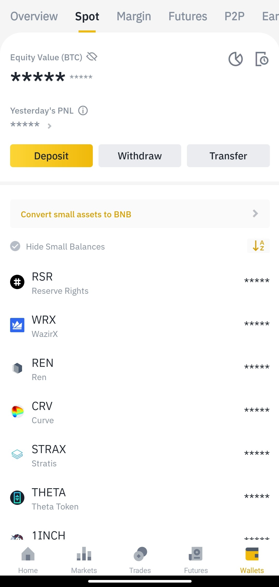
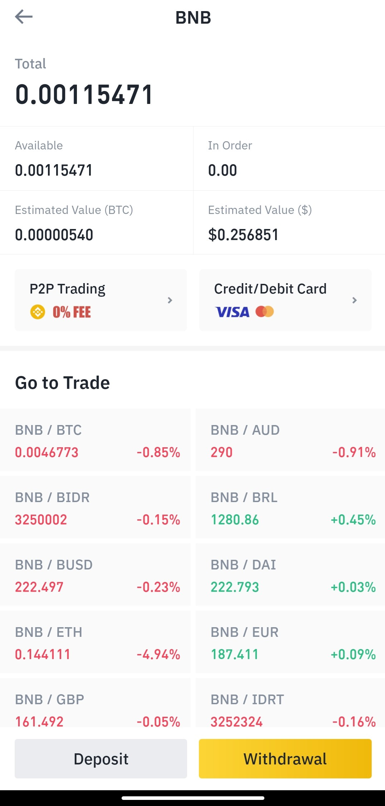
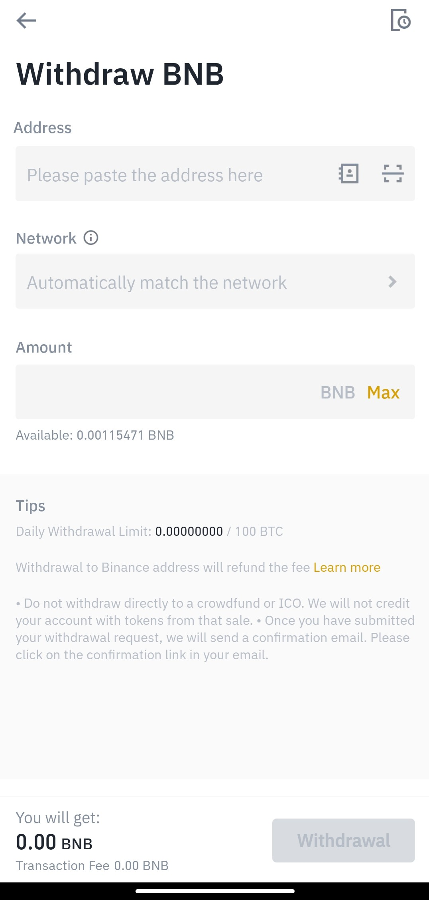
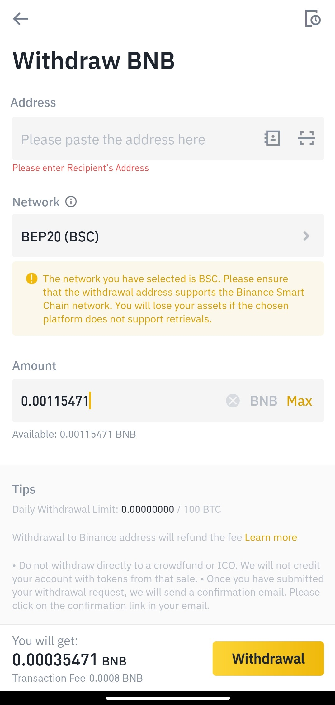

# How to send funds from Binance to Trust Wallet

### 1. Find out our BSC address. 

Select **Smart Chain BNB** and press "Receive" to find out the "Smart Chain" \(BSC\) address. Copy the address.  

### 2. Transfer funds from Binance. 

We will first transfer from Binance to Trust Wallet the BNB we have purchased on previous steps. Know that the following process and the address we have copied are the same for any other asset we want to transfer to and use on BSC network.

### 3. Open the Binance App. 

​

​

### 4. Go to Wallet. 

Click on the "Wallet" icon at the bottom right of the screen.

​

​

### 5. Select Spot. 

We will now see the Spot Wallet screen on our device.

​

​

### 6. Select BNB. 

​

​

### 7. Press "Withdrawal". 

​

​

### 8. Paste the Trust Wallet "Smart Chain" address we copied before. 

​See step 1.

### 9. Select the BEP20 \(BSC\) network. 

​

### 10. Enter the desired BNB amount and press "Withdrawal". 

​

We will have to verify the transaction. A few seconds later, a Binance email will be sent to our mail confirming our withdrawal.

At the same time, a Trust Wallet notification will confirm the BNB deposit.

​

### 11. Well done! Funds successfully sent to Trust Wallet. 

We can now proceed to use our **Smart Chain BNB** on the BSC through the Trust Wallet DApps browser:



