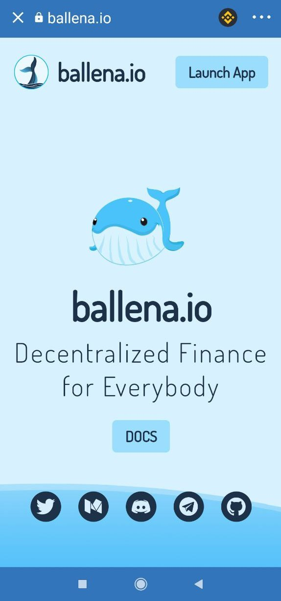

# How to use DApps in Trust Wallet

### How to surf through DApps on the Binance Smart Chain

### 1. **iOS users, in order to access this functionality in Trust Wallet,  will need the DApps browser.** 

This browser can be found in the following guide by clicking[ here](https://community.trustwallet.com/t/how-to-use-the-dapp-browser-on-ios/69390?ref=JLI1VBLA&utm_source=TrustTwitter&utm_medium=TrustSocial&utm_campaign=TrustSocial). Android users have the DApp browser by default.

### 2. Open the DApps browser.

In Trust Wallet, click on the 4 square icon at the bottom of the screen to access the DApps browser.

### 3. Navigate to a BSC DApp: PancakeSwap.

Simply select PancakeSwap among the options shown on the interface.

### 4. **Navigate to**[ **ballena.io**](https://ballena.io/) **🐋 using the DApp browser.**

In the top search bar type "ballena.io" and it will lead us directly to the landing we see below:  

Congratulations! We are almost there. We just need to know how to participate in  [ballena.io ](https://ballena.io/)🐋:



