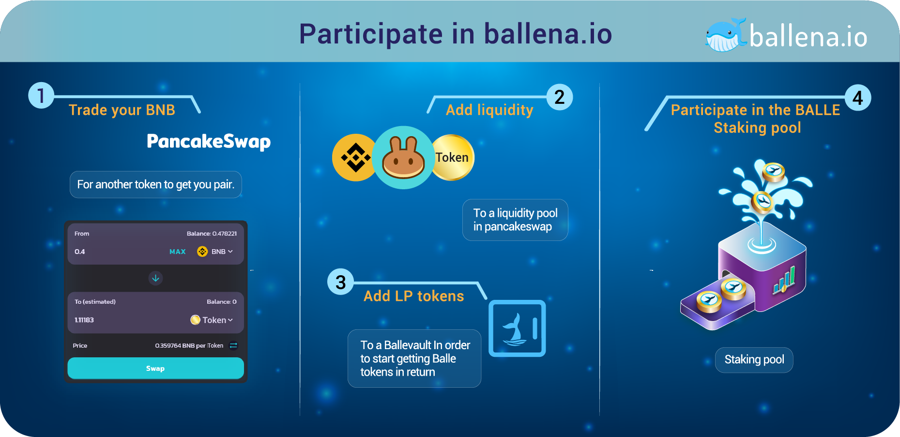

# Participate in ballena.io

###  **Participate in a BalleVault and generate BALLEv2 tokens**

Through the steps explained in this section, we will invest our money in a BalleVault in[ **ballena.io**](https://app.ballena.io/)🐋. As we already know, the platform will give us high returns on the invested assets and, in addition, it **will reward us with BALLEv2 tokens**.

**Learn more about the method ballena uses to multiply our investment in** [**this link**](../../../../../getting-started-1/getting-started.md)**.**

Let's learn about the first step on the next page:



### \*\*\*\*



  

