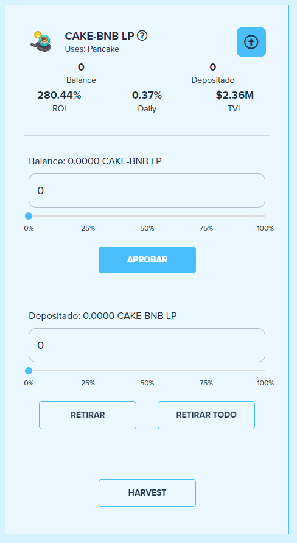

# Add LP tokens to a BalleVault

## Add LP tokens to a BalleVault in [ballena.io](https://ballena.io/)

You will learn how to add your LP tokens to the BalleVaults in this short tutorial.

Remember that [adding liquidity](add-liquidity-to-a-liquidity-pool.md) to a pair in PancakeSwap is mandatory in order to participate in a BalleVault as LP tokens are deposited.

### 2. Navigate to [ballena.io](https://ballena.io).

### 

### 3. Press “Launch App”.

### 

### 4. Find your desired BalleVault.

Once in [ballena.io](https://ballena.io), you can see all the BalleVaults in the first screen. Use the browser for easy navigation through all of them and use the filters as desired.

### 

### 5. Once our BalleVault is selected, click on the downwards arrow to see the vault´s details.

### 

### 6. Now approve the contract clicking on “Aprobar”.

### 

### 7. Confirm the transaction.

### 

### 8. Select the desired LP tokens amount to be deposited in the BalleVault.

### 9. Deposit the funds \("DEPOSITAR"\) in the desired BalleVault.

You can add a value to be deposited or press Deposit All\("DEPOSITAR TODO"\) in order to deposit your LP tokens.

### 10. Confirm the transaction.

After confirmation you will see that your LP tokens transfer from the field Balance to the field Deposited. This process can take a little while.

### 

### 11. Done! Your BalleVault is already working and yield farming.

