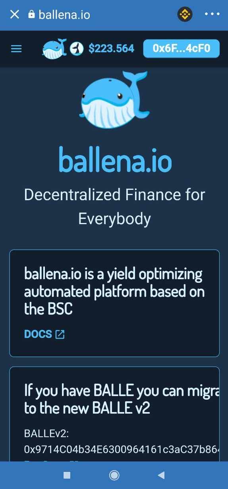

# Add LP tokens to a BalleVault

Just follow the steps in this short tutorial that[ **ballena.io**](https://ballena.io/) ****shows us to add the LP tokens to the BalleVaults and start generating passive income.

### 1. **Using the DApps browser in Trust Wallet, go to the** [**ballena.io**](https://ballena.io/) **address.**

We will land on the Home Page.

### 2. **At the top right, click "Connect".**

\*\*\*\*

\*\*\*\*

### **3. Select Trust Wallet.** 

### **4. Display the menu with the button on the top left and go to the** _**Vaults**_ **interface.**

Find the corresponding vault to the LP tokens we own.

If we are following the example of the previous tutorials, we seek the "bALBT-BNB" vault.

### **5. Deposit into the selected vault.**

 ****Approve the vault before.

### **6. Once the menu is displayed, we select the quantity.**

Slide the little whale or just choose a percentage.

Approve the transaction in Trust Wallet and pay the gas fees.  
  

### **8. Done! Our LP tokens are already working in the vault.**

We can also see how the amount of LPs as well as the amount of BALLE generated are progressively increasing.

Eventually, once we have **generated enough BALLE,** we will **harvest** them and **stake** them in the **Governance Pool**. Thus, with the BALLE we have earned, we will be able to **produce more BALLE** for our own **benefit**.



