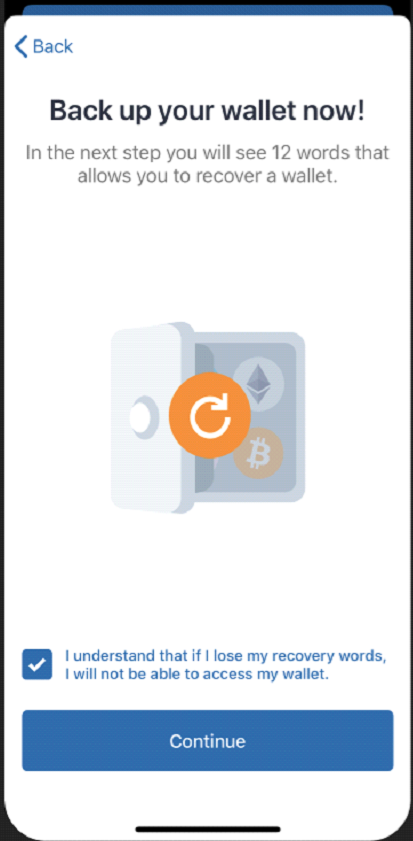

# Set up a wallet: TrustWallet

## Setting up Trust Wallet for the Binance Smart Chain

Trust Wallet can be downloaded from the following[ link](https://share.trustwallet.com/kuBobNL1Mab). It is always recommended updating the application to the latest version.

### 1. Download Trust Wallet from official sources only.

* [App Store](https://apps.apple.com/app/trust-ethereum-wallet/id1288339409)
* [Google Play](https://play.google.com/store/apps/details?id=com.wallet.crypto.trustapp)

### 

### 2. Start Trust Wallet.

After the first start of the application, we will be presented with the following screen where we can select between "Create a new wallet" or importing an existing one. For this guide, we will create a new wallet.

### 

### 3. Accept the terms of use and click on "Continue".

Read carefully everything that appears on the screen.

### 

### 4. Write down Recovery Phrase.


Remember to **write this phrase down in the right order, store it in a safe place** \( preferably offline\) and never disclose it to anyone. T**he failure to do so could mean the total loss of your funds.**



Remember to **write this phrase down in the right order, store it in a safe place** \(preferably offline\) and never disclose it to anyone. **The failure to do so could mean the total loss of your funds.**


  

### 

### 5. Verify Recovery Phrase.

If we followed the previous step and have backed up the Recovery 12 Words, just have to select the words one by one in the correct order. Click on "Continue" when done.  

### 

### 6. Trust Wallet is ready!

After going through the backup and verification process, we will be redirected to the main wallet screen. Great work so far!

  

From this inicial list of coins, we will focus on **Smart Chain BNB**. Let's see how to receive this coin from Binance:



