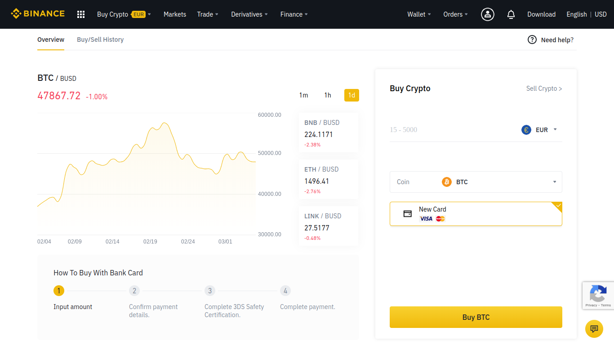
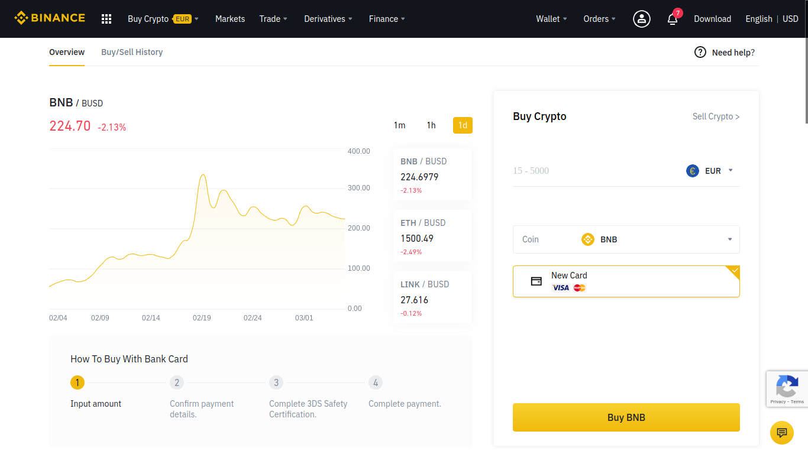
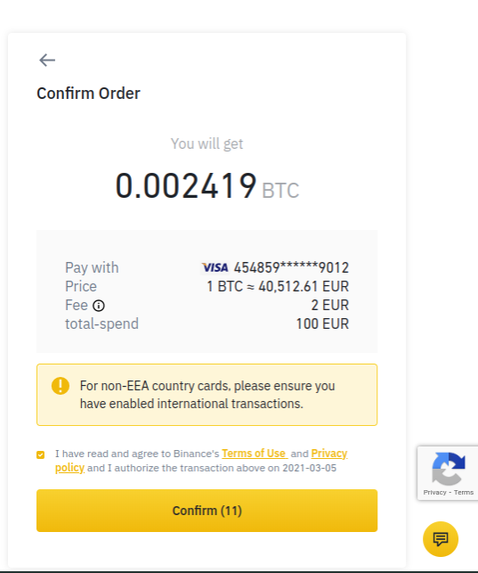

# Buy BNB in Binance\(Credit Card\) - PC

## How to buy BNB in Binance \(Credit Card\)

You can also buy BNB directly with your credit card instead of depositing and converting your funds as seen before. This way, you will pay a little higher fees but the process is much easier and faster. Check the required steps below.

### 1. Click on the button "Buy Crypto" located in the top bar menu.

### 

### 2. Select the "Credit/Debit Card" option.

### 3. Select the desired currency, enter the quantity and click on "Continue".

### 

### 4. Select BNB.

Remember that almost all projects in the BSC use BNB as a trade coin and as the fee payment currency. You shall then need BNB for working through the BSC. Select BNB in the menu for purchasing it.

### 5. Check that you have already verified your Binance account.

If you haven't done this yet, you won't be able to perform the operation and a screen like the following will be displayed.

### 6. Confirm the transaction.

As soon as your identity has been verified, you will be able to proceed with the next step and confirm the transaction.

Once the operation has been validated you will be shown the confirmation screen. You should take into account that some banks may require some authorization actions from you.

### 7. Completed!

