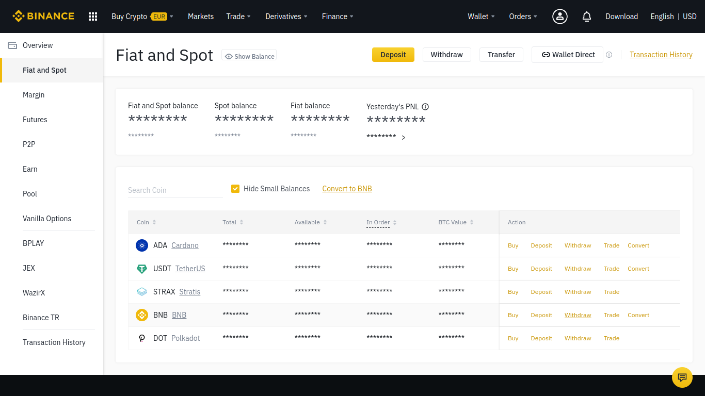
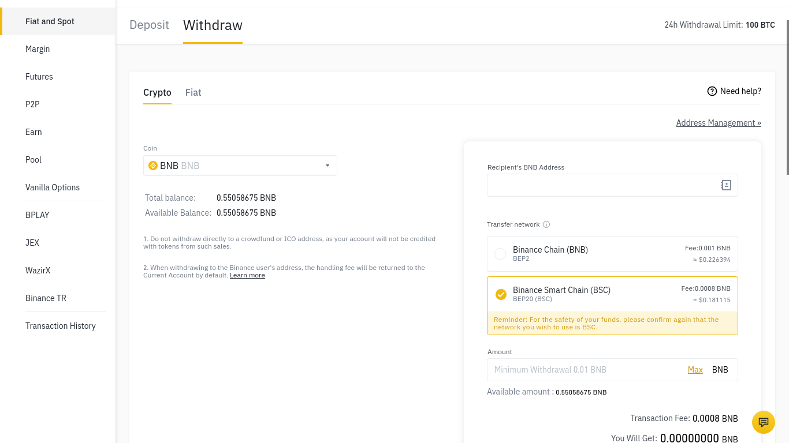
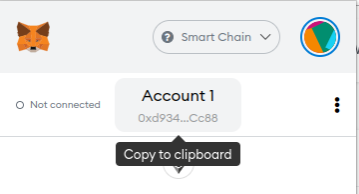
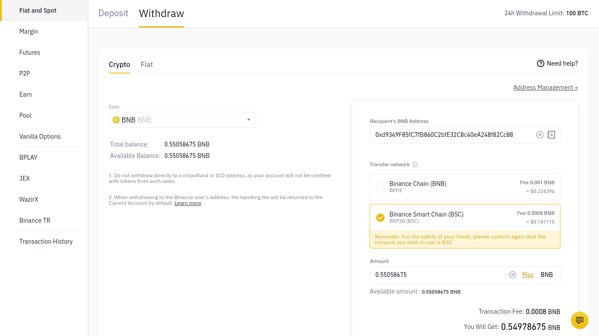

# How to send funds from Binance to Metamask - PC

## How to send funds from Binance to Metamask

[ballena.io](https://ballena.io/)🐋 will help you transfer your funds from Binance to Metamask in a few steps. Let´s go!

## Step by step

### 1. Open the Binance web page and log in with your credentials. Now, navigate to "Wallet-Fiat and Spot".

### 

### ​2. Now, select "Withdraw" on the BNB line.

### 

### 3. Fill in the fields at the right hand panel. First, select "Binance Smart Chain \(BSC\)".

​​

​

### 4. Copy our Metamask address to the clipboard.

Click on the Metamask extension in our browser and make sure that the BSC network is selected \(See image below\). Now, click on the "Account 1" button so as to copy the address.

​

### 

### 7. Finally, paste our address in the "Recipient´s BNB Address" field, enter the desired quantity and click "Send".

Give it a couple of minutes for your BNB tokens to appear in your Metamask wallet. 

​​

