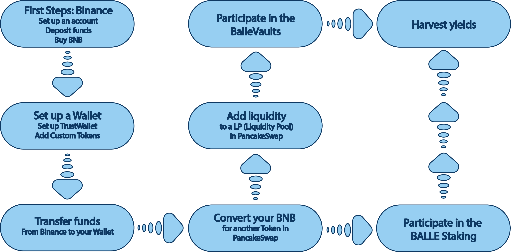

# Smartphone/Tablet

You have chosen the Smartphone/Tablet. The steps are almost similar for both platforms but we have designed these highly detailed steps in[ ballena.io](https://ballena.io/).

We will need these tools for the Smartphone/Tablet:

* **Binance App**.
* **Wallet** - We will use TrustWallet.

The Binance App will let us start with the first steps and buy BNB, the required cryptocurrency for reaching our goal of getting the highest yields with [ballena.io](https://ballena.io/).

TrustWallet will be used for accessing the Dapps like PancakeSwap and [ballena.io](https://ballena.io/), as well as moving our crypto for trading, buying, adding liquidity or paying fees.

