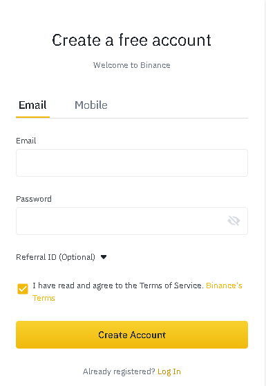
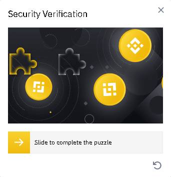
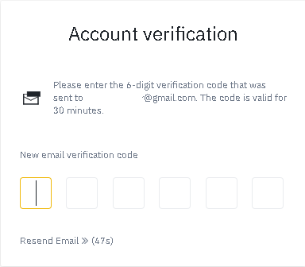
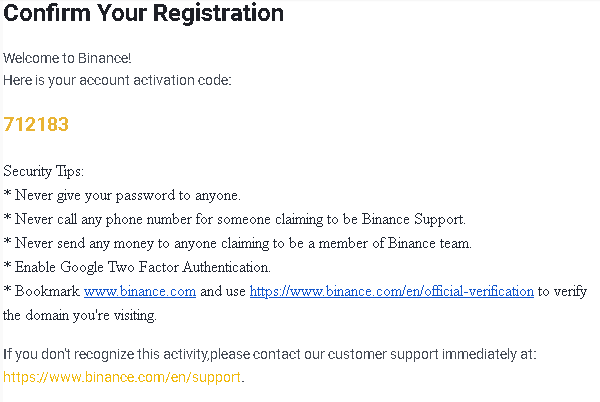

# Set up a Binance account - Smartphone/Tablet

## How to set up a Binance account

We need to set up an account in one of the exchanges in the crypto-market. Which one will you use? The choice is yours! Our tutorial is based on [Binance](https://www.binance.com/en).

### 1. Navigate to [Binance](https://www.binance.com/en) in your browser.

Open your browser and navigate to the [Binance ](https://www.binance.com/en)webpage. We recommend you insert the address directly into your browser and always verify you are working in the right domain.

### 2. Click on the Download button.

Press the banner to the App Store for the app download.

### 3. Press "Install" in the App Store.

### 4. Wait till the download process is completed and press "Open".

### 5. Create your account.

Fill in the required fields in this section. 

### 4. Click on "Create account".

Click on "Create account" and complete the security verification sliding the puzzle piece to its correct position.

### 

### 5. Obtain the verification code.

Check your mail and get the required code.

We shall see an email like the following one.

### 

### 6. Introduce your verification code.

Use the received six digit code to complete the verification phase.

### 7. Once verified, you have successfully set up a Binance account. 

